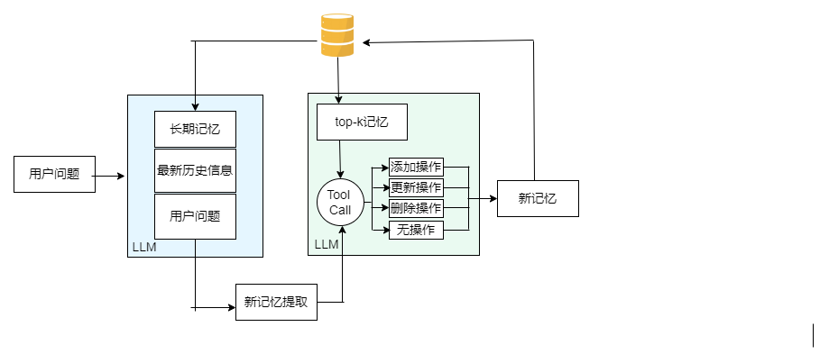
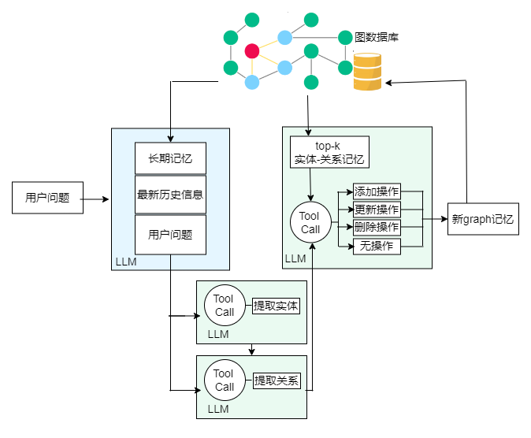

###Mem0      
Mem0 是一个智能记忆管理系统，专注于从对话中提取、存储和更新用户的长期记忆。它的核心目的是通过智能化的记忆存储和检索，帮助 AI 系统更好地理解和服务用户。Mem0 采用了向量数据库和 LLM（大语言模型）相结合的技术，提供高效的记忆更新和管理功能。
##主要步骤：
#1.信息提取阶段
●Mem0 从用户的对话中提取有价值的信息（如用户偏好、兴趣、长期任务等）。
●信息经过处理，生成结构化的 memory object（记忆对象），并且为这些信息生成简洁的摘要。
#.记忆更新（Update）：
●在每次对话中，Mem0 会根据新提取的信息检查现有记忆，并新增、更新或删除不再相关的记忆。
●更新过程中，Mem0 会检索 Top-K 相似记忆，根据这些记忆执行添加、更新、删除或不操作等四种操作。

###Mem0-graph

###Mem0-v3

+----------+---------------------+---------------------+---------------------------+---------------------+---------------------+
| 表名     | ID                  | 实体名称            | 嵌入向量                  | 关联记忆ID列表      | 创建时间            | 更新时间            |
+----------+---------------------+---------------------+---------------------------+---------------------+---------------------+---------------------+
| entity   | ent_李明            | 李明                | [0.2, 0.6, 0.4, ..]       | ["mem_001"]         | 2026-08-13 10:00:00| 2026-08-13 10:00:00|
| _store   |                     |                     |                           |                     |                     |                     |
+----------+---------------------+---------------------+---------------------------+---------------------+---------------------+---------------------+

+----------+---------------------+---------------------+---------------------------+---------------------+---------------------+
| 表名     | ID                  | 实体名称            | 嵌入向量                  | 关联记忆ID列表      | 创建时间            | 更新时间            |
+----------+---------------------+---------------------+---------------------------+---------------------+---------------------+---------------------+
| entity   | ent_李明            | 李明                | [0.2, 0.6, 0.4, ..]       | ["mem_001"]         | 2026-08-13 10:00:00| 2026-08-13 10:00:00|
| _store   |                     |                     |                           |                     |                     |                     |
+----------+---------------------+---------------------+---------------------------+---------------------+---------------------+---------------------+