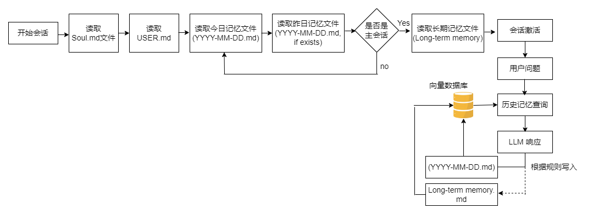

###OpenClaw记忆架构
      OpenClaw记忆架构 采用独特的文件驱动方式管理 AI 代理的长期记忆，其架构与传统的向量数据库系统相比，提供了更高的透明度和可控性。它使用Markdown 文件作为唯一真实的记忆存储，结合SQLite 索引和BM25/向量混合搜索技术，实现高效的记忆存取。
## 三层记忆架构
○Soul.md/USER.md：存储用户的核心偏好、基本设定、长期习惯等相对静态的信息。
○MEMORY.md：长期策划记忆，包含用户偏好、技术栈决策等。
○memory/YYYY-MM-DD.md：每日日志，记录当天的活动和上下文。
      这些文件都采用纯文本存储，便于查看、修改和版本控制，确保完全透明与可控。
##记忆检索与注入
#混合搜索
       OpenClaw 使用BM25和向量搜索的加权融合，提供更精准的记忆检索，解决了语义匹配和精确词元匹配的需求。
#上下文注入
       系统根据需要将记忆注入对话上下文，确保在每次会话中，AI 代理能够访问到相关的历史信息。
##记忆管理与更新
#自动写入与更新：
       记忆的写入是由Agent主导的，当有新的决策或信息时，Agent会自动将其保存到对应的日志文件中，确保每次会话的记忆能即时更新。
#压缩机制：
       由于记忆量的增长，OpenClaw采用预压缩机制，在上下文窗口逼近上限时，系统会主动将较旧的消息进行总结或截断，减少数据冗余。
