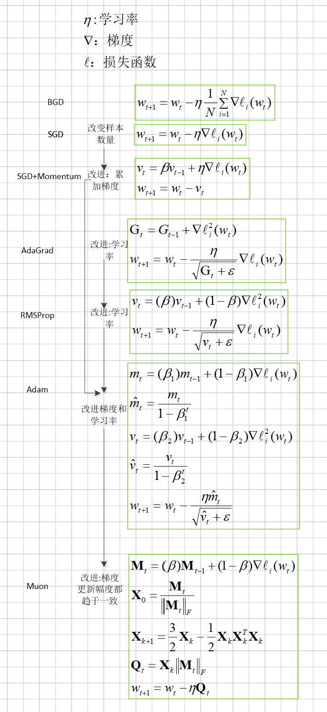

### 优化器发展历程

## 示例
 以y=Relu(wx),其中w=[[0.1,0.2].[0.3,0.4]],x=[1,2]^T y=[1,1]
  L=-[ylog(p)+(1-y)log(1-p)]为例进行说明。

 \frac{\partial L}{\partial w} = \frac{\partial L}{\partial p} \cdot \frac{\partial p}{\partial w}
  \frac{\partial L}{\partial p} = -\frac{y}{p} + \frac{1-y}{1-p}

\frac{\partial L}{\partial p} = \frac{p - y}{p(1-p)}
\frac{\partial p}{\partial w} = 
\begin{cases} 
x, & wx > 0 \\ 
0, & wx < 0 
\end{cases}

   \frac{\partial L}{\partial w}=[-0.5,1]^T[1,2]
# SGD
   