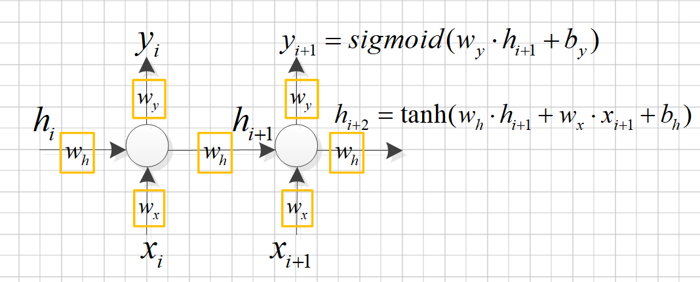
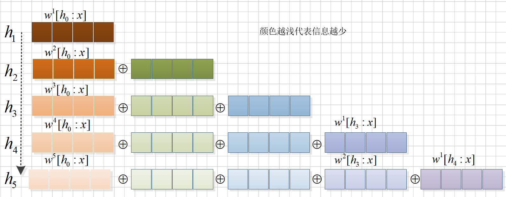

### RNN

# 问题
1、为什么计算隐藏状态h时，采用tanh激活函数而不是其他激活函数？
2、为什么h_t的计算公式一般写成如下格式
h_t = \phi\left( W \cdot [h_{t-1}; x_t] + b_h \right)
因为[h_{t-1}; x_t]是程序中的cat操作且W=[w_h;w_x]，因此
h_t = \phi\left( W \cdot [h_{t-1}; x_t] + b_h \right)
    =\phi\left([w_h;w_x] \cdot [h_{t-1}; x_t]+ b_h \right)
    =\phi\left(w_h \cdot h_{t-1}+w_x \cdot x_t+ b_h \right)

3、为什么RNN具有遗忘历史信息性，如下图所示。

